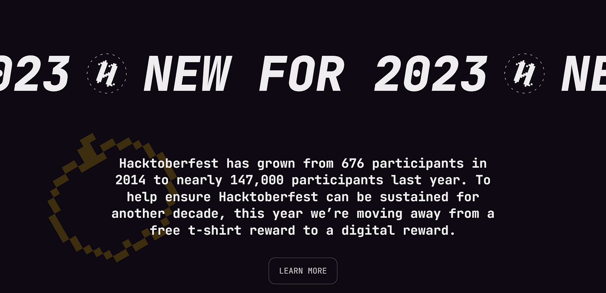
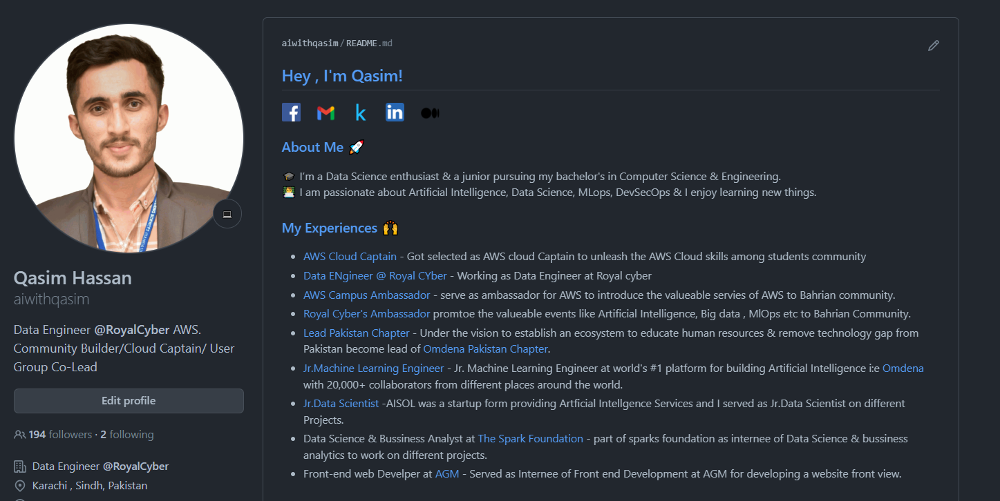

<div align="center">
	<p>
        <b><i>Let's Contribute To Open-source</i></b>
    </p>
</div>

Hacktoberfest, in its 10th year, is a month-long celebration of open-source software run by DigitalOcean. During the month of October, we invite you to join open-source software enthusiasts, beginners, and the developer community by contributing to open-source projects.

### *Background - (learn-join-and-win)*
Usually, newbies like Students who recently started using Github didn't know much about how to contribute to a team. This Hacktoberfest 2023 challenge will not only help them to get started but we can contribute as a team plus have some swags as a token of appreciation. 

Note: This challenge is mainly targeting newbies (Students) in Bahria University to get started with Github, but if you're not from Bahria University you can still read the README & contribute according to instructions.

### *Completing the Challenge*

If you have previously never contributed to any open-source software then these steps will help you get started:

1. Go to Hacktoberfest [official website](https://hacktoberfest.digitalocean.com/) and sign in there using your GitHub.
2. Install git and setup in your computer. Download and install it from [here](https://git-scm.com/downloads).
3. Fork this repository by click the Fork button in the top right of this page or simply [click here](https://github.com/sharjeelyunus/hacktoberfest/fork).
4. Once it is forked, clone the repository in your computer. For this, copy the URL in the address bar, and use the following command:

```sh
git clone <url_you_just_copied>
```

4. Open this cloned repository in your preferred code editor. Also, open a terminal in this directory.
5. Now type in the following command in the terminal and replace `username` with your GitHub username.

```sh
git checkout -b dev
```

6. Create a folder with your Name, University & Section using following pattern

```sh
Name_University_Section (i:e., QasimHassan_BahriaUniveristy_BCE8A)
```

7. Add your customized personalized `README.md` as shown below as proof that you ahve get started with GitHub. 




8. Make Sure your `README.md` have following this block with necessary info of yourself.
```
    {
      "name": {YOUR_NAME},
      "batch": {YOUR_BATCH_COMMENCEMENT_YEAR},
      "major": {YOUR_DEPARTMENT},
      "githubUsername": {YOUR_GITHUB_USERNAME},
      "favoriteLanguage": {YOUR_FAVOURITE_PROGRAMMING_LANGUAGE}
    }
```

9. Once you have done all this, commit your changes to GitHub. You can do this with the following commands. Make sure you execute them in the precise order one after another in your terminal.

```sh
# copy and paste the following in the terminal
git add .

# copy and paste the following in the terminal after you have executed the previous command
git commit -m "hacktoberfest contribution"

# copy and paste the following in the terminal after you have executed the previous command
git push -u origin dev
```

10. Now open the forked repository on your GitHub. You will see a yellow box at the top telling you that some changes are pushed. You will also see a button called `Compare & pull request`. Click on it.
11. Now add a title, some description! You have opened a pull request in this repository.

*You need to open **four** valid pull requests in order to complete the challenge. If you have performed the above steps, you have already opened one pull request. And you need only three more.*

<br>

>Note: Those repositories who have `hacktoberfest` as a label are considered for Hacktoberfest challenge only.
